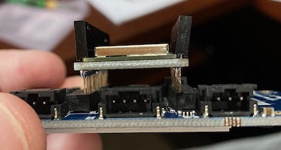

# PyBadge Wi-Fi

This repo contains instructions on how to get an [Adafruit PyBadge](https://www.adafruit.com/product/4200) connecting to Wi-Fi using an [Adafruit Airlift FeatherWing](https://www.adafruit.com/product/4264).

> The code here can also be used to connect a PyPortal to Wi-Fi using the built in ESP32 chip

## Hardware

* An [Adafruit PyBadge](https://www.adafruit.com/product/4200) - this is a Circuit Python device that has a display and controllers similar to a game console. Out of the box it doesn't have Wi-Fi connectivity, but it does have a FeatherWing socket on the back to plug in add-on boards.

* An [Adafruit Airlift FeatherWing](https://www.adafruit.com/product/4264) - this is an ESP32 based Wi-Fi add-on board for Adafruit devices. It comes with headers, and when soldered on can plug into the FeatherWing socket on the back of the PyBadge.

### Assembling the hardware

1. Solder the headers to the Airlift FeatherWing


1. Plug the FeatherWing into the socket on the back of the PyBadge



1. Connect the PyBadge to your computer via the USB socket

## Software

The software to connect to the Wi-Fi needs some Adafruit Circuit Python libraries, as well as some custom code. You can find the code in the [Code](./Code) folder.

### Install the Adafruit libraries

1. Head to the [Circuit Python Releases on the Adafruit GitHub repo](https://github.com/adafruit/Adafruit_CircuitPython_Bundle/releases)

1. Download the latest version of the libraries for the version of Circuit Python you are using

1. Unzip the downloaded file if necessary

1. Locate the PyBadge on your computer. It should be mounted as a drive called `CIRCUITPYTHON`

1. Inside the PyBadge folder, open the `lib` folder

1. Copy the following files/folders from the downloaded Circuit Python libraries to the `lib` folder on the PyBadge

    | Name                    | Type   |
    | ----------------------- | ------ |
    | `adafruit_bus_device`   | Folder |
    | `adafruit_esp32spi`     | Folder |
    | `adafruit_requests.mpy` | File   |

### Define a secrets file with Wi-Fi details

Rather than encode Wi-Fi connection details in code, it is better to put them in a separate file that can be hidden from source code control, either by adding it to your `gitignore`, or by hiding changes using [this technique](https://www.jimbobbennett.io/hiding-api-keys-from-git/).

1. Create a file called `secrets.py` in the root of the `CIRCUITPYTHON` folder.

1. Add the following to this file

   ```python
    secrets = {
        'ssid' : '<SSID of your Wi-Fi>',   # Keep the two '' quotes around the name
        'password' : '<Password>',         # Keep the two '' quotes around password
        }
   ```

   Set `<SSID of your Wi-Fi>` to be the SSID of your Wi-Fi

   Set `<Password>` to be the password for your Wi-Fi

### Connect to the Wi-Fi

1. Create a new file in the root of the `CIRCUITPYTHON` folder called `connection.py`

1. Add the following code to this file. You can find this file in the [Code](./Code) folder if you just want to copy it to your PyBadge

    ```python
    import board, busio
    from secrets import secrets
    from digitalio import DigitalInOut
    import adafruit_requests as requests
    import adafruit_esp32spi.adafruit_esp32spi_socket as socket
    from adafruit_esp32spi import adafruit_esp32spi

    class Connection:
        def __connect(self, spi, cs, ready, reset, log):
            esp = adafruit_esp32spi.ESP_SPIcontrol(spi, cs, ready, reset)

            requests.set_socket(socket, esp)

            if log:
                print("Connecting to AP...")

            while not esp.is_connected:
                try:
                    esp.connect_AP(secrets['ssid'], secrets['password'])
                except RuntimeError as e:
                    if log:
                        print("could not connect to AP, retrying: ",e)
                    continue

            if log:
                print("Connected to", str(esp.ssid, 'utf-8'), "\tRSSI:", esp.rssi)
                print("My IP address is", esp.pretty_ip(esp.ip_address))

        # Connect a PyPortal
        def connect_pyportal(self, spi, log = False):
            esp32_cs = DigitalInOut(board.ESP_CS)
            esp32_ready = DigitalInOut(board.ESP_BUSY)
            esp32_reset = DigitalInOut(board.ESP_RESET)

            self.__connect(spi, esp32_cs, esp32_ready, esp32_reset, log)

        # Connect a PyBadge
        def connect_pybadge(self, spi, log = False):
            esp32_cs = DigitalInOut(board.D13)
            esp32_ready = DigitalInOut(board.D11)
            esp32_reset = DigitalInOut(board.D12)

            self.__connect(spi, esp32_cs, esp32_ready, esp32_reset, log)
    ```

1. Add the following code to the `code.py` file in the `CIRCUITPYTHON` folder. This file should already be there as part of the default install, but if it is not there, create it. This file is run when the PyBadge boots up.

    ```python
    import board
    import busio
    import adafruit_requests as requests
    from connection import Connection

    spi = busio.SPI(board.SCK, board.MOSI, board.MISO)

    conn = Connection()
    conn.connect_pybadge(spi, True)

    TEXT_URL = "http://wifitest.adafruit.com/testwifi/index.html"

    print("Fetching text from", TEXT_URL)
    r = requests.get(TEXT_URL)
    print('-'*40)
    print(r.text)
    print('-'*40)
    r.close()

    print("Done!")
    ```

    This code uses the `Connection` module to connect to Wi-Fi, then downloads some test to show that it is working.

1. Save the file. The PyBadge will reboot and connect to the Wi-Fi. You will see the connection on the PyBadge screen and in your terminal if you are connected [to the serial output](https://learn.adafruit.com/welcome-to-circuitpython/kattni-connecting-to-the-serial-console).

    ```
    Press any key to enter the REPL. Use CTRL-D to reload.soft reboot

    Auto-reload is on. Simply save files over USB to run them or enter REPL to disable.
    code.py output:
    Connecting to AP...
    Connected to <SSID>         RSSI: -52
    My IP address is 192.168.197.188
    Fetching text from http://wifitest.adafruit.com/testwifi/index.html
    ----------------------------------------
    This is a test of Adafruit WiFi!
    If you can read this, its working :)

    ----------------------------------------
    Done!
    ```

